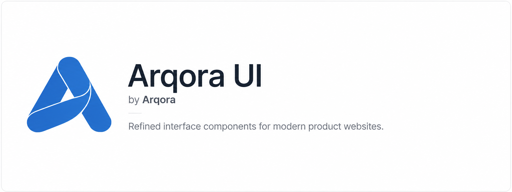

  

# arqora-ui

A small open-source collection of refined interface components, visual surfaces, and structural patterns built for modern product and developer-focused websites.

Designed with a restrained, minimal approach under Arqora.

## Status

Early development.  
Components and documentation will be added gradually.

## License

[MIT](./LICENSE)
